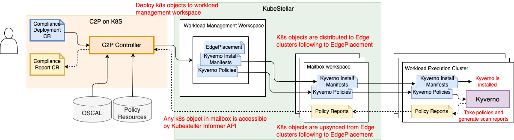
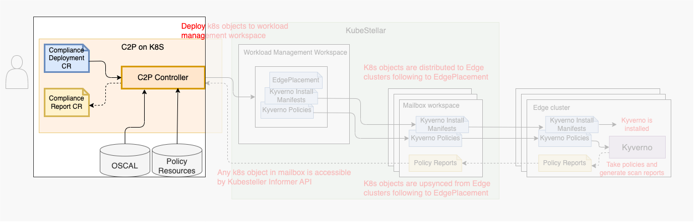
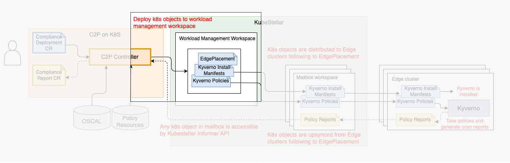
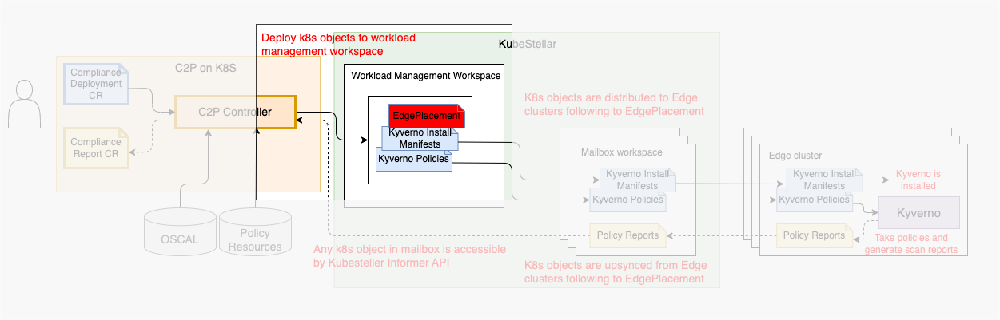
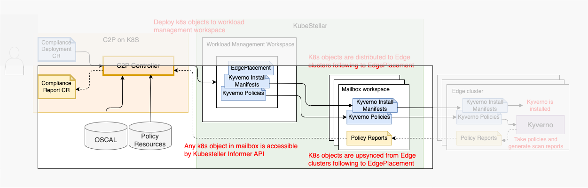

# C2P controller for KubeStellar w/ Kyverno

## C2P

C2P provides a framework to bridge compliance into technical policy. This is for supporting compliance officers to automate continuous compliance management across multi Kubernetes clusters. For example, compliance officers creates compliances based on NIST SP 800-53, that is a document of a collection of 1189 controls, then puts to C2P. C2P converts the compliance into required technical policies for a security check tool like Kyverno, run the tool, and produces compliance summary to the officer.

There is a standard format called [OSCAL](https://pages.nist.gov/OSCAL/) to represent such compliance document in machine-friendly format. Compliance officers writes Compliance in OSCAL by using [Trestle](https://github.com/IBM/compliance-trestle) authoring tool. In this PoC, only single security tool is assumed, which is Kyverno. In short, C2P takes OSCAL, deploy Kyverno policies, and collect Kyverno scan reports (called PolicyReports).

For single cluster:
```
Compliance (OSCAL) ---> C2P ---> Kyverno Policies ---> Kubernetes cluster

Compliance Summary <--- C2P <--- PolicyReports  <--- Kubernetes cluster
```

For multi-cluster:
```
Compliance (OSCAL) ---> C2P ---> Kyverno Policies + *EdgePlacement ---> KubeStellar ---> multiple Kubernetes clusters

Compliance Summary <--- C2P <--- PolicyReports per cluster <--- KubeStellar <--- multiple Kubernetes clusters
```

\*EdgePlacement is one of CR defined in KubeStellar that describes what objects should be deployed to which clusters. Explained the details later.
- EdgePlacement CRD: https://github.com/kubestellar/kubestellar/blob/main/config/crds/edge.kcp.io_edgeplacements.yaml
- Sample yaml: https://github.com/kubestellar/kubestellar/blob/main/config/samples/edgeplacement_dev.yaml
- Tutorial: https://docs.kubestellar.io/main/Coding%20Milestones/PoC2023q1/placement-translator/#create-and-populate-the-workload-management-workspace-for-the-common-workload

## Technical details about C2P controller and KubeStellar integration

C2P controller is one of the implementation of C2P that runs as a Kubernetes controller. C2P controller takes [Compliance Deployment CR](https://github.com/IBM/compliance-to-policy/blob/main/config/crd/bases/compliance-to-policy.io_compliancedeployments.yaml).



Example Compliance Deployment CR
```
apiVersion: compliance-to-policy.io/v1alpha1
kind: ComplianceDeployment
metadata:
  name: compliancedeployment-sample
spec:
  compliance:
    name: NIST_SP-800-53-HIGH # Any name for identifying compliance
    catalog:
      url: https://raw.githubusercontent.com/usnistgov/oscal-content/main/nist.gov/SP800-53/rev5/json/NIST_SP-800-53_rev5_catalog.json # OSCAL Catalog URL
    profile:
      url: https://raw.githubusercontent.com/usnistgov/oscal-content/main/nist.gov/SP800-53/rev5/json/NIST_SP-800-53_rev5_HIGH-baseline_profile.json # OSCAL Profile URL
    componentDefinition:
      url: https://github.com/IBM/compliance-to-policy/blob/template/oscal/component-definition.json # OSCAL Component Definition URL
  policyResources: 
    url: https://github.com/IBM/compliance-to-policy/tree/template/policy-resources # Policy Resource URL
  clusterGroups:
    - name: cluster-nist-high # Any name for identifying managed clusters
      matchLabels:
        compliance-level: nist-high # Label (key-value pair) that's added to clusters listed in KubeStellar inventory
  binding:
    compliance: NIST_SP-800-53-HIGH # Compliance name
    clusterGroups:
    - cluster-nist-high # ClusterGroup name
  target:
    workspace: wmw # Workload Management Workspace
```

### Prerequisite
Finished setting up KubeStellar and workload execution clusters
- It can be done by going through [quickstart](https://docs.kubestellar.io/release-0.4/Getting-Started/quickstart/)
- Note that at step [c. Onboarding the clusters](https://docs.kubestellar.io/release-0.4/Getting-Started/quickstart/#c-onboarding-the-clusters), we labeled `compliance-level=nist-high` instead of `env=prod` 

###  1. Transform OSCAL to Policy



1. C2P reads Compliance Deployment CR
1. C2P retrieves OSCAL files from OSCAL repository
1. C2P parses OSCAL and computes required policies
1. C2P retrieves the required policies from Policy Resources repository

### 2. Deploy kyverno install manifests and policies to WMW



1. C2P deploys Kyverno install manifests with `name: kyverno` labeled
    - Kyverno install manifests: https://github.com/IBM/compliance-to-policy/tree/template/policy-resources/policy-install-kyverno-from-manifests/policy-install-kyverno-from-manifests (It is equivalent with the output of `helm template kyverno --set replicaCount=1 --namespace kyverno --create-namespace --version 2.6.5 kyverno/kyverno --dry-run`)
1. C2P deploys the retrieved policy manifests with `name: kyverno` labeled
    - Example policy: https://github.com/IBM/compliance-to-policy/blob/template/policy-resources/policy-kyverno-require-labels/policy-kyverno-require-labels/ClusterPolicy.require-labels.0.yaml
1. Deploy the following apibinding to make apps.deployments resource available (KCP workspace does not have some resources pre-defined by K8S.) 
    ```
    apiVersion: apis.kcp.io/v1alpha1
    kind: APIBinding
    metadata:
      name: bind-kube
    spec:
      reference:
        export:
          path: "root:compute"
          name: kubernetes
    ```

### 3. Generate EdgePlacement



EdgePlacement Spec consists of 4 fields. 
- locationSelectors
- namespaceSelector
- nonNamespacedObjects
- upsync

```
apiVersion: edge.kcp.io/v1alpha1
kind: EdgePlacement
metadata:
  name: edge-placement
spec:
  locationSelectors: []
  namespaceSelector: {}
  nonNamespacedObjects: []
  upsync: []
```

Let's explain one-by-one of C2P usage.

1. locationSelectors
    - KubeStellar distributes objects to clusters that match to any of element of locationSelectors 
    - In Compliance Deployment CR, `compliance-level: nist-high` is specified. C2P sets locationSelectors like
        ```
        locationSelectors:
        - matchLabels: {"compliance-level":"nist-high"}
        ```
1. namespaceSelector
    - KubeStellar distributes namespaced objects in namespaces that match to namespaceSelector.
    - C2P labels `name: kyverno` to any namespace that C2P creates so C2P sets namespaceSelector like 
        ```
        namespaceSelector:
          matchLabels: {"name":"kyverno"}
        ```
1. nonNamespacedObjects
    - KubeStellar distributes cluster scoped objects listed in nonNamespacedObjects.
    - C2P needs KubeStellar to distribute all cluster scoped objects for Kyverno install manifests (CRD, ClusterRole, ClusterRoleBinding) and Kyverno ClusterScopedPolicy (ClusterPolicy) so C2P sets these resources in ApiGroup/Resource/ResourceName format like
        ```
        nonNamespacedObjects:
        - apiGroup: apiextensions.k8s.io
          resources:
          - customresourcedefinitions
          resourceNames:
          - admissionreports.kyverno.io
          - backgroundscanreports.kyverno.io
          - clusteradmissionreports.kyverno.io
          - clusterbackgroundscanreports.kyverno.io
          - clusterpolicies.kyverno.io
          - clusterpolicyreports.wgpolicyk8s.io
          - generaterequests.kyverno.io
          - policies.kyverno.io
          - policyreports.wgpolicyk8s.io
          - updaterequests.kyverno.io
        - apiGroup: rbac.authorization.k8s.io
          resources:
          - clusterroles
          resourceNames:
          - kyverno:admin-policies
          - kyverno:admin-policyreport
          - kyverno:admin-reports
          - kyverno:admin-generaterequest
          - kyverno:admin-updaterequest
          - kyverno
          - kyverno:userinfo
          - kyverno:policies
          - kyverno:view
          - kyverno:generate
          - kyverno:events
          - kyverno:webhook
        - apiGroup: rbac.authorization.k8s.io
          resources:
          - clusterrolebindings
          resourceNames:
          - kyverno
        - apiGroup: kyverno.io
          resources:
          - clusterpolicies
          resourceNames:
          - "*"
        - apiGroup: apis.kcp.io
          resources:
          - apibindings
          resourceNames:
          - "bind-kube"
        ```
    - The last element (`- apiGroup: apis.kcp.io`) is for making apps.deployments resource available in each mailbox workspace (See also section 2.3).
1. upsync
    - KubeStellar upsyncs either namespace or non-namespace objects listed in upsync.
    - C2P needs KubeStellar to upsync PolicyReports/ClusterPolicyReports generated by Kyverno in each Edge cluster so C2P sets these resources in ApiGroup/Resource/ResourceName format like
        ```
        upsync:
        - apiGroup: wgpolicyk8s.io
          resources:
          - policyreports
          - clusterpolicyreports
          namespaces:
          - "*"
          names:
          - "*"
        ``` 

### 4. Collect PolicyReports



Policy reports are upsynced to each mailbox workspace.
1. C2P fetches cluster list from KubeStellar inventory
    - The equivalent kubectl is like as follows.
    ```
    kubectl ws root:inv1
    kubectl get SyncTarget -o go-template='{{"CLUSTER_NAME,MAILBOX_WORKSPACE\n"}}{{- range.items -}}{{ $name := .metadata.name }}{{ $uid := .metadata.uid }}{{ $cluster := index .metadata.annotations "kcp.io/cluster" }}{{$name}}{{","}}{{"root:espw:"}}{{$cluster}}{{"-mb-"}}{{$uid}}{{"\n"}}{{- end -}}'
    ```
    ```
    CLUSTER_NAME,MAILBOX_WORKSPACE
    florin,root:espw:2qlfxqear6azo14a-mb-819d137e-78ba-4f30-aaf1-7096a15e2489
    guilder,root:espw:2qlfxqear6azo14a-mb-4ab00da0-2aad-4240-ad80-c849d9782f7a
    ```
1. C2P collects PolicyReports from mailbox workspaces
    - The equivalent kubectl is like as follows.
    - For `florin` cluster
        ```
        kubectl ws root:espw:2qlfxqear6azo14a-mb-819d137e-78ba-4f30-aaf1-7096a15e2489
        kubectl get policyreports -A
        ```
        ```
        NAMESPACE                            NAME                                                     PASS   FAIL   WARN   ERROR   SKIP   AGE
        default                              policyreport.wgpolicyk8s.io/cpol-sample-cluster-policy   0      1      0      0       0      7m44s
        kube-node-lease                      policyreport.wgpolicyk8s.io/cpol-sample-cluster-policy   0      1      0      0       0      7m43s
        kube-public                          policyreport.wgpolicyk8s.io/cpol-sample-cluster-policy   0      2      0      0       0      7m43s
        kube-system                          policyreport.wgpolicyk8s.io/cpol-sample-cluster-policy   0      7      0      0       0      7m43s
        kubestellar-syncer-florin-1rv6gz3u   policyreport.wgpolicyk8s.io/cpol-sample-cluster-policy   0      1      0      0       0      7m43s
        kyverno                              policyreport.wgpolicyk8s.io/cpol-sample-cluster-policy   2      1      0      0       0      7m43s
        local-path-storage                   policyreport.wgpolicyk8s.io/cpol-sample-cluster-policy   0      2      0      0       0      7m42s
        ```
    - For `guilder` cluster
        ```
        kubectl ws root:espw:2qlfxqear6azo14a-mb-4ab00da0-2aad-4240-ad80-c849d9782f7a
        kubectl get policyreports -A
        ```
        ```
        NAMESPACE                             NAME                         PASS   FAIL   WARN   ERROR   SKIP   AGE
        default                               cpol-sample-cluster-policy   0      1      0      0       0      8m56s
        kube-node-lease                       cpol-sample-cluster-policy   0      1      0      0       0      8m56s
        kube-public                           cpol-sample-cluster-policy   0      2      0      0       0      8m55s
        kube-system                           cpol-sample-cluster-policy   0      7      0      0       0      8m55s
        kubestellar-syncer-guilder-2bve2zb2   cpol-sample-cluster-policy   0      1      0      0       0      8m55s
        kyverno                               cpol-sample-cluster-policy   2      1      0      0       0      8m55s
        local-path-storage                    cpol-sample-cluster-policy   0      2      0      0       0      8m54s
        ```
1. C2P also collects Kyverno running status from mailbox workspaces
    - The equivalent kubectl is like as follows.
    - For `florin` cluster
        ```
        kubectl ws root:espw:2qlfxqear6azo14a-mb-819d137e-78ba-4f30-aaf1-7096a15e2489
        kubectl get deployment -n kyverno
        ```
        ```
        NAME      READY   UP-TO-DATE   AVAILABLE   AGE
        kyverno   1/1     1            1           13m
        ```
    - For `guilder` cluster
        ```
        kubectl ws root:espw:2qlfxqear6azo14a-mb-4ab00da0-2aad-4240-ad80-c849d9782f7a
        kubectl get deployment -n kyverno
        ```
        ```
        NAME      READY   UP-TO-DATE   AVAILABLE   AGE
        kyverno   1/1     1            1           13m
        ```
1. C2P generates compliance reports from those evidences.